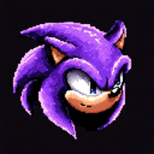

  

# Sepehr Behroozi – Personal Portfolio Website

This is my personal portfolio website, showcasing my background, projects, skills, and interactive features. Built with HTML, CSS, and JavaScript.

---

## Features

### About Me
- Introduction and highlights about my background, values, and approach.

### Education & Achievements
- Details about my degree, university, and notable awards.

### Experience
- Work and research experience, including roles, responsibilities, and links to code or demos.

### Projects
- Portfolio of software, research, and web projects, each with a description and links to source code or demos.

### Skills
- Overview of programming languages, frameworks, developer tools, and libraries I use.

### Contact
- Contact information and a form to send me a message directly.

### Meme of the Day
- A fun page that displays a different meme image each day, with animated emojis.

### Terminal Games
- Retro-style terminal interface with classic games:
  - Tic Tac Toe (with AI)
  - Memory Game
  - Minesweeper (with explosion effects)
  - Command-line interface for launching games and commands

---

## License

See [LICENSE](LICENSE) for details.
